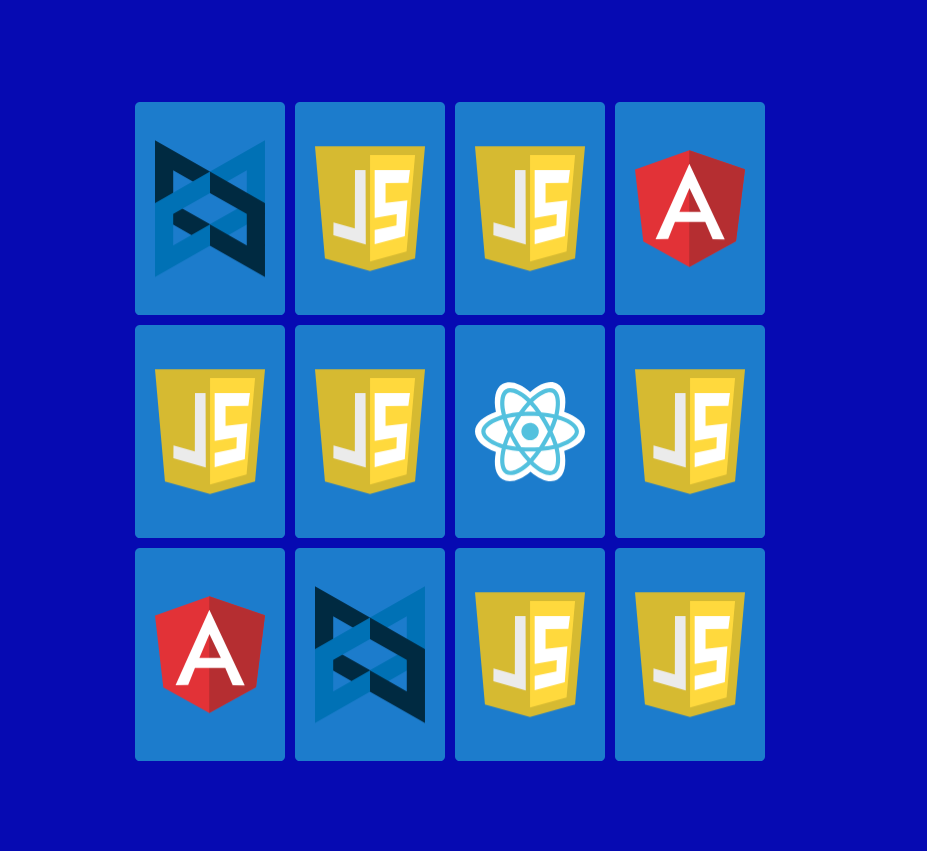

# 🧠 Memory Game

A simple and fun browser-based **Memory Card Game** built with vanilla **JavaScript**, **HTML**, and **CSS**.  
Developed as part of a Udemy JavaScript course to practice DOM manipulation, game logic, and state handling.



---

## 🎮 Overview

This project is a browser game where players flip cards to find matching pairs.  
Each card represents a popular JavaScript framework (React, Vue, Angular, Ember, Aurelia, Backbone).  
The layout, logic, and animations are all handled without external libraries.

I built this project by following the course challenges and implementing them from scratch 
focusing on **clean logic**, **reusable functions**, and **smooth CSS animations**.

---

## 🚀 Features

- Flip cards with smooth 3D animations  
- Detect matching pairs using `data-*` attributes  
- Auto-lock board while animations play  
- Shuffle cards on every reload  
- Fully responsive design  
- Built without frameworks – just **HTML**, **CSS**, and **JavaScript**

---

## 🧩 Tech Stack

- **HTML5** – structure and semantics  
- **CSS3** – animations, flexbox layout, and transitions  
- **Vanilla JavaScript (ES6)** – event handling, game logic, array shuffling  
- **SVG icons** – provided by the course instructor

---

## 💡 What I Learned

- DOM selection and manipulation  
- Managing game state and timing logic  
- Using dataset attributes to compare elements  
- Writing cleaner, modular JS functions  
- Handling transitions and asynchronous behavior with `setTimeout()`  
- Shuffling and positioning elements dynamically

---

## 🕹️ How to Play

1. Open `index.html` in your browser  
2. Click any card to flip it  
3. Match pairs of the same JavaScript framework  
4. When all cards are matched — you win 🎉 

---

## ⚙️ Setup

Clone the repository:

```bash
git clone https://github.com/MirkoRimac/memory-game.git
cd memory-game
